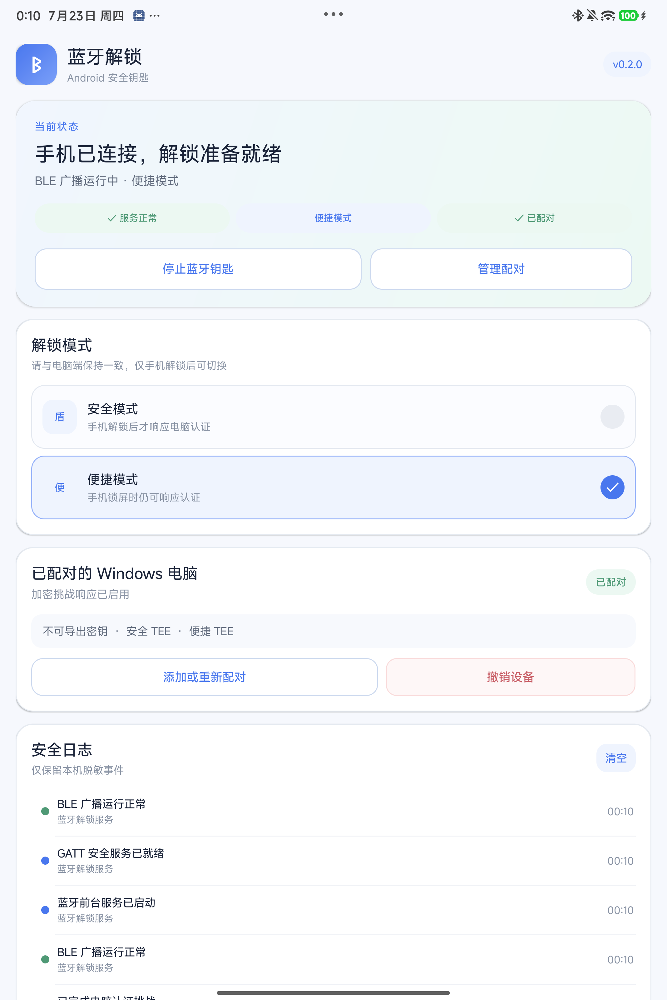

# Proximity Unlock

Proximity Unlock 是一套面向个人使用的蓝牙近距离自动解锁工具，支持一台
Windows 11 电脑和一部 Android 15 及以上版本的手机。Windows 协调服务使用
Go 编写，手机端使用 Kotlin 实现 BLE 外设，Windows 锁屏界面通过小型原生
V2 凭据提供程序接入。

> [!WARNING]
> 本项目不会替换或隐藏 Windows 密码、PIN、Windows Hello 等系统登录方式。
> 首次启用凭据提供程序前，必须先通过服务自检并完成手机配对。蓝牙 RSSI
> 不是安全的距离证明，无法彻底阻止专业中继攻击。

## 主要功能

- 手机靠近并通过加密挑战后，自动解锁已经登录且处于锁定状态的本地控制台会话。
- 支持安全模式和便捷模式，以及可选的“锁屏后立即解锁”模式。
- 支持手动修改解锁/锁定 RSSI 阈值、距离校准、自动锁定、高灵敏响应、RSSI 趋势预测、认证失败冷却开关、暂停、撤销手机、更新 Windows 密码和完整卸载。
- 配对、设置、凭据提供程序注册和卸载均集成在中文桌面控制中心和任务栏托盘中，普通用户无需输入命令。
- Android 端采用与电脑端一致的浅色仪表盘，集中显示 BLE 状态、解锁模式、配对设备、硬件密钥后端和脱敏安全日志。
- 开机登录、注销、RDP、UAC 和 CredUI 不会自动解锁，仍需使用系统登录方式。

## 安全边界

- 默认情况下，手机仍在附近时按下 `Win+L`，电脑会保持锁定；手机必须离开至少
  10 秒后再次靠近。设置页中的“锁屏后立即解锁”选项会跳过此离开再返回要求，
  因而安全性较低。
- Microsoft 账户密码仅存储在 Windows LSA 私密数据中，不会写入
  `config.json` 或日志。
- Android 应用保存两把不可导出的 P-256 密钥：安全模式在手机锁屏时拒绝签名，
  便捷模式允许锁屏后台签名。
- 每次解锁均使用新的随机数、短期授权和单调计数器，并拒绝过期或重放的响应。
- 普通 BLE/GATT 超时只会短暂退避并继续尝试；只有签名错误、重放或协议非法等
  安全失败才累计默认的五分钟冷却。设置页可以关闭此保护，但会降低安全性。
- 高灵敏模式使用独立的近距离触发阈值，并自动在其下方保留 `8 dB` 锁定防抖区。
  锁屏时首个符合阈值的新鲜广播会在约 `0.2` 秒内发起认证；认证失败、有效证明缺失
  或持续低于派生锁定线后，服务会继续检测，只有连续 `10` 秒未恢复才自动锁定。
  任意一次有效认证或信号恢复都会重置对应计时，兼顾快速返回解锁与短时波动容错。
- “设备”页只修改普通模式的解锁/锁定阈值；高灵敏触发值位于“设置 → 高灵敏模式 →
  参数”的独立弹窗。普通解锁和锁定阈值必须至少相差 `8 dB`；高灵敏模式会自动
  派生低 `8 dB` 的锁定保护线，避免在边界反复锁定。
- 可选的“多普勒预测”实际使用最近 RSSI 样本的增强斜率预测手机是否即将达到解锁
  阈值，并提前发起挑战；它不是物理层射频多普勒测量，也不会绕过手机签名。只有
  新鲜签名验证通过后才会提交凭据，预测解锁后连续 `10` 秒拿不到有效证明会重新锁定；
  这条预测专用安全复核不受普通“自动锁定”开关影响。预测灵敏度可在独立弹窗中设置为
  `1` 至 `100`。
- 距离趋势按真实时间显示滚动最近 `10` 分钟，并每 `2` 秒采样一次；不会再把刚启动后
  的短时间数据拉伸成完整十分钟。电脑端日志保留本次服务运行的最近 `100` 条脱敏事件，
  连续重复的认证成功或同类认证失败不会反复写入。

## 下载与安装

请从仓库的 [Releases](https://github.com/Singualow/windows_unlock/releases)
页面下载：

- `ProximityUnlockInstaller.exe`：Windows 一键安装程序。
- `ProximityUnlock-Android.apk`：Android 15+ 手机应用。

安装前请确保自己知道当前 Microsoft 账户的真实密码，而不只是 PIN。

1. 双击 Windows 安装程序并批准 UAC，按系统安全对话框输入当前账户密码。
2. 在 Android 手机上安装 APK，并授予附近设备和通知权限。
3. 打开任务栏托盘中的“蓝牙解锁”，在“设备”页生成二维码，用手机在两分钟内扫描。
4. 配对完成并确认手机信号正常后，在“设置”的“系统维护”区域启用 Windows 锁屏自动解锁。
5. 始终保留 PIN、密码或 Windows Hello 作为恢复方式。

如果手机端曾点击“停止蓝牙钥匙”，不需要重新扫码；打开手机应用并点击“启动蓝牙
钥匙”即可在保留现有配对和不可导出密钥的情况下恢复 BLE 前台服务。

Windows 可执行文件和 DLL 尚未进行商业代码签名，系统可能显示 SmartScreen
警告。请只从本仓库 Release 下载，并核对 Release 页面提供的 SHA-256。

## 仓库结构

- `cmd/proximity-service`：以 LocalSystem 运行的 Windows 服务和协调器。
- `cmd/proximityctl`：初始化、状态、校准及维护控制程序。
- `cmd/proximity-agent`：旧版 Go 托盘实现，仅为兼容和历史参考保留，不再随安装包安装。
- `desktop`：当前用户的 Tauri 2 中文控制中心、任务栏托盘、会话监视和自动锁定程序。
- `cmd/installer`：内嵌全部 Windows 组件的单文件图形安装器。
- `internal`：协议、密码学、状态机、安全存储和 IPC 实现。
- `android`：Android 15 BLE 外设应用。
- `native/credential-provider`：x64 V2 凭据提供程序。
- `native/ble-broker`：Windows 原生 BLE 后端和诊断程序。
- `scripts`：开发者使用的构建、测试、恢复和卸载脚本。

## 开发文档

- [构建与安全安装](docs/BUILD.md)
- [BLE 协议](docs/PROTOCOL.md)
- [安全模型](docs/SECURITY.md)
- [桌面控制中心开发说明](desktop/README.md)
